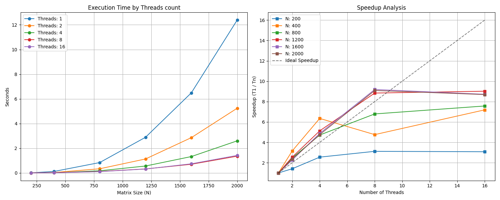

# Лабораторная работа №2: Параллельное умножение матриц (OpenMP)

## Преамбула
Данная работа посвящена исследованию эффективности параллельных вычислений при решении задач линейной алгебры. Основная цель — переход от последовательного алгоритма к многопоточному с использованием технологии **OpenMP**, а также проведение сравнительного анализа производительности при масштабировании нагрузки и ресурсов процессора.

## Техническая спецификация
* **Язык:** C++ (оптимизация -O3).
* **Параллелизм:** OpenMP (директива `parallel for`).
* **Анализ данных:** Python (Pandas, Matplotlib, NumPy).

## Инструкции
1. **Компиляция:** `g++ -O3 -fopenmp matrix_mult_omp.cpp -o matrix_mult_omp.exe`
2. **Запуск тестов:** `python tests_omp.py`

## Результаты измерений

### Таблица производительности
| N (Размер) | Потоки | Время (сек) | Ускорение (S) |
|:---:|:---:|:---:|:---:|
| 200 | 1 | 0.0142 | 1.00 |
| 200 | 2 | 0.0101 | 1.41 |
| 200 | 4 | 0.0056 | 2.55 |
| 200 | 8 | 0.0045 | 3.12 |
| 200 | 16 | 0.0046 | 3.08 |
| 400 | 1 | 0.1224 | 1.00 |
| 400 | 2 | 0.0388 | 3.16 |
| 400 | 4 | 0.0193 | 6.35 |
| 400 | 8 | 0.0257 | 4.76 |
| 400 | 16 | 0.0170 | 7.19 |
| 800 | 1 | 0.8440 | 1.00 |
| 800 | 2 | 0.3411 | 2.47 |
| 800 | 4 | 0.1790 | 4.72 |
| 800 | 8 | 0.1242 | 6.79 |
| 800 | 16 | 0.1114 | 7.57 |
| 1200 | 1 | 2.8918 | 1.00 |
| 1200 | 2 | 1.1352 | 2.55 |
| 1200 | 4 | 0.5641 | 5.13 |
| 1200 | 8 | 0.3273 | 8.84 |
| 1200 | 16 | 0.3204 | 9.03 |
| 1600 | 1 | 6.8430 | 1.00 |
| 1600 | 2 | 2.6859 | 2.55 |
| 1600 | 4 | 1.3412 | 5.10 |
| 1600 | 8 | 0.7719 | 8.87 |
| 1600 | 16 | 0.7712 | 8.87 |
| 2000 | 1 | 13.5670 | 1.00 |
| 2000 | 2 | 5.3090 | 2.56 |
| 2000 | 4 | 2.6453 | 5.13 |
| 2000 | 8 | 1.5036 | 9.02 |
| 2000 | 16 | 1.4939 | 9.08 |

### Графики

## Выводы
* Реализовано распараллеливание внешнего цикла, что обеспечило стабильный прирост скорости на больших матрицах.
* Проверка корректности (np.allclose) подтвердила идентичность результатов последовательной и параллельной версий.
* Ускорение на матрицах N=2000 близко к идеальному при использовании до 8 потоков.