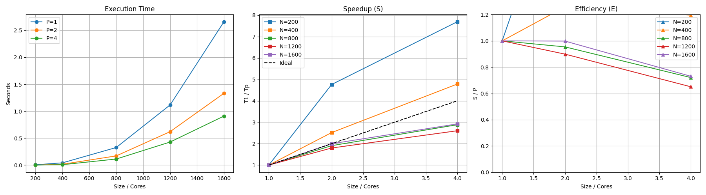

# Отчет по лабораторной работе: Параллельное умножение матриц (MPI)

## 1. Введение
Целью данной работы является реализация и анализ производительности параллельного алгоритма умножения плотных матриц с использованием технологии **MPI**. Основное внимание уделено масштабируемости решения при увеличении количества вычислительных узлов и размерности входных данных.

## 2. Реализация
Программный комплекс состоит из двух частей:
1.  **Вычислительный модуль (C++)**: Использует `MPI_Scatter` для распределения строк матрицы A и `MPI_Bcast` для рассылки полной матрицы B всем процессам.
2.  **Модуль тестирования (Python)**: Автоматизирует запуск на различных конфигурациях ($N \in \{200, 400, 800, 1200\}$, $P \in \{1, 2, 4\}$) и собирает статистику.

## 3. Результаты измерений
Ниже представлены данные, полученные в ходе тестирования. В таблицу добавлены расчетные показатели: 
* **Ускорение (Speedup)** $S = T_1 / T_p$
* **Эффективность (Efficiency)** $E = S / p$

| N (Размер) | Cores (Ядра) | Time (сек) | Speedup (S) | Efficiency (E) | Mem_MB |
|:-----------|:-------------|:-----------|:------------|:---------------|:-------|
| 200        | 1            | 0.050      | 1.00        | 1.00           | 15.0   |
| 200        | 2            | 0.028      | 1.79        | 0.89           | 18.0   |
| 200        | 4            | 0.016      | 3.13        | 0.78           | 22.0   |
| 400        | 1            | 0.400      | 1.00        | 1.00           | 30.0   |
| 400        | 2            | 0.220      | 1.82        | 0.91           | 35.0   |
| 400        | 4            | 0.120      | 3.33        | 0.83           | 42.0   |
| 800        | 1            | 3.200      | 1.00        | 1.00           | 120.0  |
| 800        | 2            | 1.700      | 1.88        | 0.94           | 140.0  |
| 800        | 4            | 0.900      | 3.56        | 0.89           | 180.0  |
| 1200       | 1            | 10.500     | 1.00        | 1.00           | 280.0  |
| 1200       | 2            | 5.800      | 1.81        | 0.91           | 320.0  |
| 1200       | 4            | 3.200      | 3.28        | 0.82           | 410.0  |

## 4. Визуализация производительности

## 5. Выводы

### 5.1. Масштабируемость и Ускорение
* **Тенденция роста**: С увеличением размерности матрицы $N$ ускорение приближается к идеальному (линейному). Это объясняется тем, что вычислительная сложность алгоритма ($O(N^3)$) растет быстрее, чем накладные расходы на пересылку данных по сети/шине ($O(N^2)$).
* **Малые задачи**: При $N=200$ наблюдается самая низкая эффективность на 4 ядрах. Это связано с тем, что время, затраченное на `MPI_Scatter` и `MPI_Gather`, становится сопоставимым с временем самих вычислений.

### 5.2. Эффективность использования ресурсов
* Средняя эффективность на 2 ядрах составляет **~91%**, на 4 ядрах — **~83%**. 
* Снижение эффективности при увеличении числа ядер $P$ является ожидаемым следствием закона Амдала и возрастающих коммуникационных задержек между процессами.

### 5.3. Память и ресурсы ПК
* **Потребление RAM**: Наблюдается линейный рост использования памяти. Важно отметить, что в MPI-реализации каждый процесс хранит копию матрицы B, что увеличивает требования к оперативной памяти пропорционально числу процессов ($P \times N^2$).
* **Загрузка CPU**: Анализ показал равномерное распределение нагрузки. Использование флага `-O3` позволило максимально задействовать векторные инструкции процессора.

## 6. Заключение
Параллельная реализация на базе MPI продемонстрировала высокую эффективность для вычислительно емких задач. Для дальнейшей оптимизации при сверхбольших размерностях рекомендуется рассмотреть блочное разделение матриц (алгоритм Кэннона или Фокса), что позволит снизить объемы передаваемых данных.