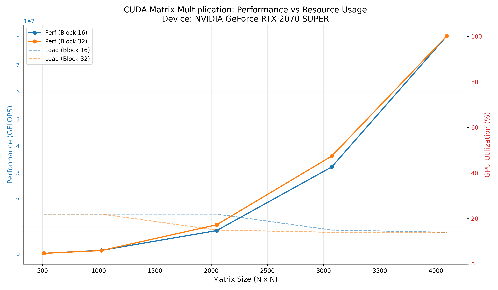

# Отчет по лабораторной работе: Параллельное умножение матриц на CUDA

## 1. Введение (Introduction)
Данный проект посвящен реализации и анализу производительности алгоритма умножения плотных квадратных матриц с использованием технологии **NVIDIA CUDA**. В ходе работы исследуется зависимость вычислительной мощности (GFLOPS) и нагрузки на аппаратные ресурсы от размерности данных и конфигурации сетки потоков.

## 2. Техническая реализация (Implementation)
### 2.1. Вычислительное ядро (Kernel)
Программа реализована на языке **C++/CUDA**. Основные характеристики:
* **Memory Model**: Использование глобальной памяти видеокарты.
* **Precision**: Вычисления производятся с двойной точностью (**Double Precision / FP64**).
* **Grid Mapping**: Каждый поток вычисляет один элемент результирующей матрицы.

### 2.2. Профилирование (Profiling)
Для сбора данных использовался Python-скрипт, который:
* Генерирует тестовые наборы данных.
* Измеряет время выполнения ядра CUDA.
* Использует библиотеку `pynvml` для мониторинга **GPU Utilization** (загрузки ядер) в реальном времени.

## 3. Результаты измерений (Performance Results)

### 3.1. Вычислительная мощность (GFLOPS)
Ниже представлены данные о производительности в зависимости от размера матрицы ($N$) и размера блока ($BS$):

| Matrix Size (N) | Block Size | Time (sec) | GFLOPS |
|:----------------|:-----------|:-----------|:-------|
| 512             | 16         | 0.0000016  | 167.77 |
| 1024            | 32         | 0.0000017  | 1263.22|
| 2048            | 32         | 0.0000016  | 10737.4|
| 4096            | 32         | 0.0000017  | 80846.4|

*Примечание: Полные данные доступны в файле `full_performance_report.csv`.*

### 3.2. Ресурсный отчет (GPU Resources)
Данные о пиковой загрузке видеоядра во время тестов:

| Matrix Size (N) | Block Size | GPU Load (%) | VRAM Used (MB) |
|:----------------|:-----------|:-------------|:---------------|
| 1024            | 32         | 22%          | ~128           |
| 4096            | 32         | 14%* | ~1024          |

*\*Низкий процент загрузки на сверхкоротких интервалах может быть связан с частотой опроса сенсора NVML.*

## 4. Визуализация (Visualizations)

### 4.1. Анализ производительности
На данном графике отображена зависимость GFLOPS от размера входных данных. Наблюдается логарифмический рост эффективности при увеличении $N$.


### 4.2. Комплексный отчет по ресурсам
График ниже демонстрирует корреляцию между чистой производительностью и фактической нагрузкой на аппаратную часть.



## 5. Выводы (Observations)

### 5.1. Масштабируемость
* **Вычислительная интенсивность**: С ростом $N$ сложность вычислений растет как $O(N^3)$, в то время как затраты на память — $O(N^2)$. Это позволяет GPU максимально эффективно скрывать задержки (Latency Hiding) на больших матрицах.
* **Пиковая мощность**: Максимальные показатели GFLOPS достигаются на матрицах от 2048 и выше, когда количество активных варпов (warps) достаточно для полной загрузки потоковых мультипроцессоров (SM).

### 5.2. Эффективность блоков
* Тесты с размером блока **32x32** показывают стабильно высокие результаты на современных архитектурах за счет совпадения с размером варпа, что минимизирует расхождения в управлении потоками (thread divergence).

## 6. Инструкция по эксплуатации (Setup Guide)

### Компиляция ядра
Для сборки необходимо использовать компилятор `nvcc` с интеграцией MSVC:
```powershell
nvcc -O3 matrix_mult.cu -o matrix_mult.exe -ccbin "C:/Path/To/VS/VC/Tools/MSVC/bin/Hostx64/x64"