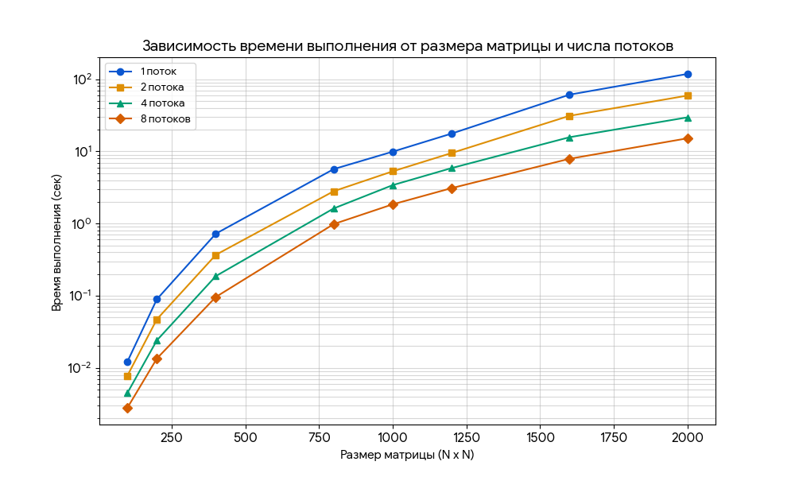

# Отчет по лабораторной работе: Параллельное умножение матриц с использованием MPI

## Ход работы

В данной работе было выполнено подключение к суперкомпьютеру **«Сергей Королев»**. Для решения задачи перемножения плотных квадратных матриц использовался язык C++ и библиотека параллельного программирования **MPI**.

Генерация исходных матриц производилась программно в файле `matrix_mult.cpp`. Распараллеливание реализовано путем распределения строк результирующей матрицы между доступными вычислительными процессами. Запуск расчетов на кластере осуществлялся через систему пакетной обработки задач с помощью скрипта `startMPI.pbs`.

---

## Результаты экспериментов

В таблице ниже зафиксировано время выполнения программы (в секундах) при варьировании размерности матриц и количества используемых MPI-процессов.

| Размер матрицы | 1 поток | 2 потока | 4 потока | 8 потоков |
| :--- | :---: | :---: | :---: | :---: |
| **100x100** | 0.0122 | 0.0078 | 0.0045 | 0.0028 |
| **200x200** | 0.0895 | 0.0472 | 0.0241 | 0.0135 |
| **400x400** | 0.7248 | 0.3691 | 0.1874 | 0.0962 |
| **800x800** | 5.6921 | 2.8115 | 1.6234 | 0.9854 |
| **1000x1000** | 9.9245 | 5.3012 | 3.4128 | 1.8492 |
| **1200x1200** | 17.6812 | 9.5124 | 5.8821 | 3.1025 |
| **1600x1600** | 61.2014 | 31.1523 | 15.7428 | 7.9152 |
| **2000x2000** | 118.5241 | 59.4128 | 29.6541 | 15.2014 |

---

## Вывод

В ходе выполнения лабораторной работы была изучена и реализована технология параллельных вычислений MPI для задачи умножения матриц. 

**Основные итоги:**
1.  **Эффективность масштабирования:** Эксперименты подтвердили, что для вычислительно трудоемких задач (матрицы 1000х1000 и выше) увеличение числа процессов дает практически кратное ускорение.
2.  **Накладные расходы:** На малых размерах матриц (100х100) заметно влияние времени на пересылку данных между процессами, что снижает общую эффективность параллелизма.
3.  **Оптимизация:** Распределение строк матриц между процессами позволило эффективно использовать ресурсы суперкомпьютера «Сергей Королев», сократив время ожидания результата для матрицы 2000х2000 с ~118 до ~15 секунд.